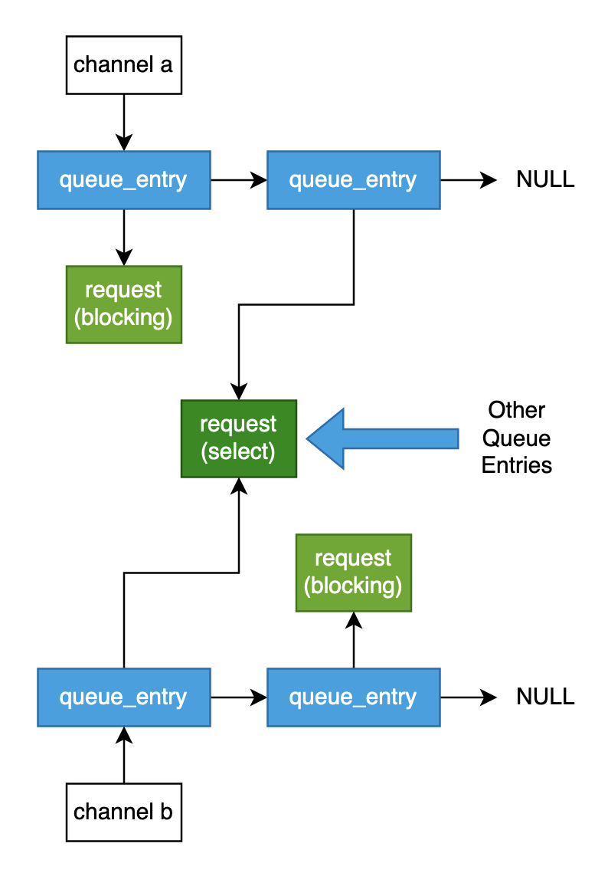

# Channels
Concurrency assignment for Operating Systems class

## Project Description
This assignment was to implement a thread-safe channel system, where multiple threads could send and receive data at the same time. The channels would have a variable size buffer in which messages could be stored, and for extra credit, a no buffer version could be implemented.
#### Part 1:
- `channel_create()`
- `channel_send()`
- `channel_recieve()`
- `channel_non_blocking_send()`
- `channel_non_blocking_recieve()`
- `channel_close()`
- `channel_destroy()`
#### Part 2:
- `channel_select()`

## What I Learned

### Technical Skills
- Concurrency in C
    - mutex locks, conditional locks, semaphores 
    - avoiding race conditions
### Practical Lessons:
- Limit function scope.
- Take inspiration from other languages and architectures, building in the functionality yourself if need be.

## Usage/Testing
As this was a class project, I would highly advise against actually using this. To test it with the built-in tests simply run:

`make test`

## My Approach

### Blocking and Non-Blocking Send/Receive
The base send and receive logic is contained in thread-unsafe functions which the thread-safe functions wrap the thread-safe code around. 

#### Thread Unsafe functions:
- `channel_unsafe_send()`
- `channel_unsafe_recieve()`

The non-blocking functions will simply obtain the necessary locks and then try the operation. The blocking functions will do the same, but if the operation fails, the operation 'request' is added to the channel's queue. This is done by creating a `request` object, which represents the thread's requested operation, as well as creating a `queue_entry` object, which references the `request` object and is placed into the channel's queue. Separating the *thread's* request and the *channel's* queue entry will become important later in the implementation of the select function.

### Select
The `channel_select()` function allows a thread to send multiple operation requests simultaneously through an array of `select_t` objects. Once an operation is completed, the index of the successful operation is returned. None of the other requested operations should be completed.

With the select function, one _thread_ now can send operation requests to multiple *channels*, hence the separation of the `request` and `queue_entry` objects. This design facilitated three important goals:

1. Select operation requests and blocking operation requests should use the same queue.
	- Both use the `queue_entry` object in channel queues.
2. The select function should be able to return without having to clean all the now obsolete `queue_entry` objects from the other channel queues. 
	- The `request` object has a reference count, which is decremented by each `queue_entry` until there are none left, where it is freed.
3. The index of the successful operation needs to be known.
	- The `queue_entry` stores the index of the operation that it represents.

Here is a layout of how select and blocking operation requests are used in the same queue: 

The select function begins by creating a `request` object to represent this thread's single select request. Then, the array of send/receive operations is attempted. Whenever an operation fails, a `queue_entry` referencing the request is added to the channel's queue. Once all of the operations are attempted without one completing, the thread waits at a semaphore for one of the channels to complete a request. 

Whenever an operation completes, whether during the initial attempt or once it is pulled from a channel queue, the `valid` flag of the request is set to false, so no other operation from the select request completes. 

### Queue Operation and Memory Management
As the select function returns without cleaning the `request` and `queue_entry` objects it creates, this is done dynamically whenever a queue is checked. The queue is checked based on a boolean set when calling an unsafe send/receive function. So, the same thread that just completed an operation, which created space in the buffer, also processes the queue.

When a channel checks its queue, it calls `request_serve()` which will complete the operation described in a `request` object. One of the arguments of `request_serve()`  is `queue_get_valid_request()`, which goes through each `queue_entry`, checking its referenced `request`, and returning the first valid request. The `queue_entry` is always freed once processed by `queue_get_valid_request()`

After a `request` is accessed by a `queue_entry`, either to complete its operation or just to confirm it has already been completed, `request_discard()` is called. Discard simply decrements the `request` reference count, until it hits zero, where it is freed. 

### Closing the Channels
Each `channel` object has a `closed` flag that is triggered by `channel_close()`. This function also calls `request_serve()` on all the channel queues, so any `request` objects remaining can be canceled. Once that is done, memory is cleaned up by calling `channel_destroy()` on each channel.